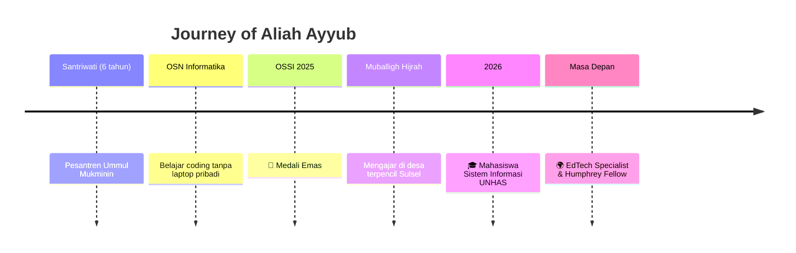

 

 

 

## 🌸 Tentang Aku

<table width="100%">
<tr>
<td width="30%" valign="top">

</td>
<td width="70%" valign="top">

| | |
|---|---|
| 👩‍🎓 **Nama Lengkap** | Aliah Ayyub |
| 🏛️ **Universitas** | Universitas Hasanuddin |
| 💻 **Program Studi** | Sistem Informasi |
| 🕌 **Latar Belakang** | 6 tahun santriwati, Pesantren Puteri Ummul Mukminin |
| 🥇 **Prestasi Utama** | Medali Emas Olimpiade Sains Seluruh Indonesia (OSSI) 2025 |
| 🕋 **Pengalaman Sosial** | Muballigh Hijrah — mengajar tajwid & agama di desa terpencil Sulsel |
| 🔭 **Sedang Fokus** | Analisis & Perancangan Sistem, Interaksi Manusia & Komputer |
| ⚡ **Organisasi** | Society of Renewable Energy (SRE) UNHAS |
| 🌍 **Impian Jangka Panjang** | Educational Technology Specialist & Hubert H. Humphrey Fellow |
| 🎯 **Misi Hidup** | "Satu Pesantren, Connected Santri" — teknologi inklusif untuk santri Indonesia Timur |
| 💬 **Prinsip Hidup** | *"Sebaik-baik manusia adalah yang paling bermanfaat bagi manusia lainnya"* |
| ⚙️ **Fun Fact** | Menulis logika pemrograman dengan tulisan tangan sebelum punya akses laptop bebas! |

</td>
</tr>
</table>

Aku percaya teknologi dan nilai yang kita jaga bukan dua kutub yang saling meniadakan.
Ketika dirancang dengan hati, keduanya bisa **saling menopang** — membentuk karakter yang utuh, bukan mengikisnya. 🤍

 

## 🧭 Perjalanan Hidupku

 

## 🎯 Fokus & Minat

<table align="center">
<tr>
<td align="center" width="25%">

### 🔍
**Analisis & Perancangan Sistem**
Memahami kebutuhan pengguna sebelum membangun solusi

</td>
<td align="center" width="25%">

### 🎨
**Human-Computer Interaction**
Merancang teknologi yang manusiawi & inklusif

</td>
<td align="center" width="25%">

### ⚡
**Energi Terbarukan**
Fondasi listrik untuk pesantren di kawasan 3T

</td>
<td align="center" width="25%">

### 🕌
**EdTech untuk Pesantren**
Menjembatani nilai keagamaan & inovasi digital

</td>
</tr>
</table>

 

## 🏆 Sorotan Pencapaian

  

  

  

 

## 🛠️ Tools & Teknologi

🌱 masih terus belajar — kalau ada rekomendasi tools/bahasa yang cocok untuk sistem inklusif, sangat terbuka untuk diskusi!

 

## 📊 GitHub Stats

 

## 🐍 Aktivitas Kontribusi

✨ animasi ular ini aktif otomatis setelah setup GitHub Action "snk" — tanya aku kalau mau dibantu!

  

## 💌 Mari Terhubung!

  

📧 &nbsp;**aliahayyub@gmail.com** &nbsp;|&nbsp; 📸 &nbsp;**@aliah.asy** &nbsp;|&nbsp; 💼 &nbsp;**aliah-ayyub-23b4aa423**

 

> 💫 *"Sebaik-baik manusia adalah yang paling bermanfaat bagi manusia lainnya"*
> — Hadis Rasulullah SAW

 

