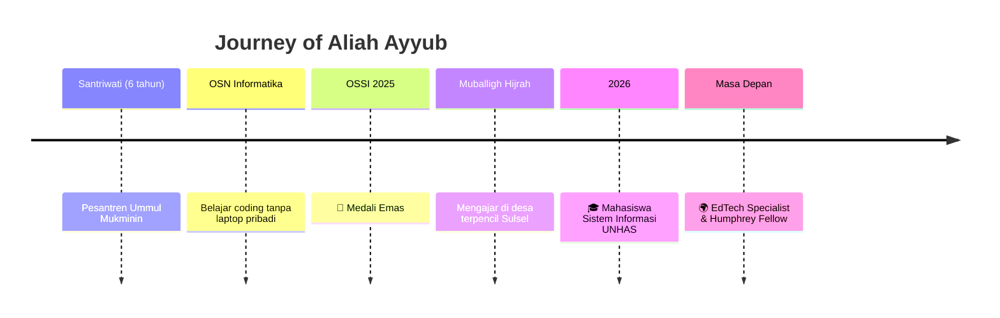

 

 

 

## 🌸 Tentang Aku

<table width="100%">
<tr>
<td width="50%" valign="top">

<h3 align="center">👩‍🎓&nbsp; Siapa Aku</h3>

Mahasiswa <b>Sistem Informasi</b> di Universitas Hasanuddin yang lahir dari lorong sunyi pesantren. Enam tahun menjadi santriwati di <b>Ummul Mukminin</b> mengajarkanku bahwa proses panjang tanpa jalan pintas justru membentuk karakter yang paling kokoh.

</td>
<td width="50%" valign="top">

<h3 align="center">🥇&nbsp; Titik Balik</h3>

Kegagalan di seleksi <b>OSN Informatika</b> karena keterbatasan akses gawai justru jadi bahan bakar. Dari sana lahir <b>Medali Emas OSSI 2025</b> dan jalan SNBP menuju kursi kuliah Sistem Informasi.

</td>
</tr>
<tr>
<td width="50%" valign="top">

<h3 align="center">📿&nbsp; Turun ke Lapangan</h3>

Sebagai <b>Muballigh Hijrah</b>, aku mengajar tajwid & nilai agama di desa terpencil Sulawesi Selatan tanpa bantuan internet — pengalaman yang membuka mataku tentang kesenjangan digital yang nyata di lapangan.

</td>
<td width="50%" valign="top">

<h3 align="center">🌍&nbsp; Yang Sedang Diperjuangkan</h3>

Merancang ekosistem <b>"Satu Pesantren, Connected Santri"</b> — teknologi inklusif yang menopang nilai keagamaan santri, menuju Indonesia Emas 2045.

</td>
</tr>
</table>

> 💭 *"Technology is not just doing something for us. It is doing something to us."*
> — **Sherry Turkle**, Profesor MIT & Ahli Psikologi Sosial-Teknologi

 

## 🧭 Perjalanan Hidupku

 

## 🎯 Fokus & Minat

<table align="center">
<tr>
<td align="center" width="25%">

### 🔍
**Analisis & Perancangan Sistem**
Memahami kebutuhan pengguna sebelum membangun solusi

</td>
<td align="center" width="25%">

### 🎨
**Human-Computer Interaction**
Merancang teknologi yang manusiawi & inklusif

</td>
<td align="center" width="25%">

### ⚡
**Energi Terbarukan**
Fondasi listrik untuk pesantren di kawasan 3T

</td>
<td align="center" width="25%">

### 🕌
**EdTech untuk Pesantren**
Menjembatani nilai keagamaan & inovasi digital

</td>
</tr>
</table>

 

## 🏆 Sorotan Pencapaian

  

  

  

 

## 🛠️ Tools & Teknologi

🌱 masih terus belajar — kalau ada rekomendasi tools/bahasa yang cocok untuk sistem inklusif, sangat terbuka untuk diskusi!

 

## 📊 GitHub Stats

 

## 🐍 Aktivitas Kontribusi

✨ animasi ular ini aktif otomatis setelah setup GitHub Action "snk" — tanya aku kalau mau dibantu!

  

## 💌 Mari Terhubung!

  

  

  

👆 klik langsung untuk menuju akunku

 

> 💫 *"Sebaik-baik manusia adalah yang paling bermanfaat bagi manusia lainnya"*
> — Hadis Rasulullah SAW

 

